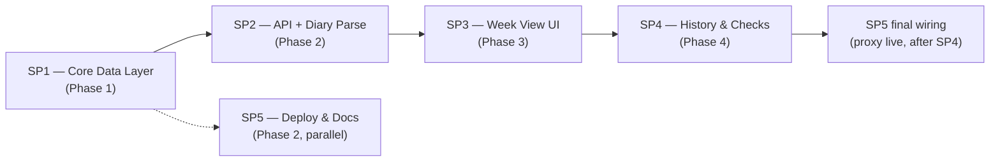

# LinkedIn Outreach Tool — Design Index

## What this is

A weekly LinkedIn outreach + presence tracker built for one person (Tejit), aimed at making a
~3–4 hr/week, five-activity-type LinkedIn growth plan survivable for someone whose failure mode is
specifically **overwhelm → boredom → discouragement → abandonment**, not task initiation (BRAINSTORM.md
§1). The tool's job, in order: make the week look small, make logging cost nothing, show visible
progress without a breakable streak, and never editorialize about a bad week. It is a standalone
SvelteKit app (no database, JSON files on disk), diary-first logging parsed by an LLM into a
preview the human must approve, and is proxied behind `cc-gateway` at `cc.tejitpabari.com/linkedin`,
gated by the existing gateway password.

This folder holds the **design** for five sub-projects (SP1–SP5) — the approved brainstorm and five
reconciled PRDs. No code has been written yet. Next steps in the pipeline are `dev-tasks` (generate
TASKS.md per sub-project) and `dev-code` (implement).

## Sub-projects

| Folder | Title | Phase | Depends on | Scope (one line) |
|---|---|---|---|---|
| `01-core-data-layer/` | SP1 — Core Data Layer + App Scaffold | 1 | none | SvelteKit scaffold, `config.js` (load/validate), `weeks.js` (ISO-week maths, week-file I/O, pure apply arithmetic) — the disk-backed core everything else imports. |
| `02-api-and-diary-parse/` | SP2 — API Routes + Diary Parse | 2 | SP1 | HTTP surface over SP1 (entries, weeks, config, items, import/export) plus `parse.js`, the one outbound call to DeepSeek, with a strict untrusted-output validator. |
| `03-week-view-ui/` | SP3 — Week View UI | 3 | SP1 + SP2 | The one-screen "this week" view: pinned links, metrics row, two lanes of task bars, diary box with Apply/Discard preview — plus the shared `weekStore` and layout slots SP4 mounts into. |
| `04-history-and-checks/` | SP4 — History, Calendar, Log & Week-4 Honesty Check | 4 | SP1 + SP2 + SP3 | History strip, month calendar + next-week view, reverse-chronological log, retro-logging correctness fix, and D24's deterministic week-4 honesty check. |
| `05-deploy-and-docs/` | SP5 — Deployment, Gateway Integration & Docs | 2 (parallel with SP2); final wiring after SP4 | none for design; wiring depends on SP1–SP4 existing | Reverse-proxy route inside `cc-gateway`, base-path/`ORIGIN` contract, PM2 ecosystem file, `.env.example`, and all repo docs (`README.md`, `CLAUDE.md`, `config/README.md`). |

## Dependency graph

SP5's design work (proxy route, base-path/`ORIGIN` contract, docs) can proceed in parallel with SP2
since it only needs SP1's file-shape contract; its **final wiring step** — actually starting both
PM2 processes and confirming the proxy end-to-end — lands after SP4 ships, once there's a full app
to point at.

## Locked decisions

All strategic and design decisions (two lanes, split ledger, weekly quota with min/target, diary-first
logging with Apply/Discard preview, config/data file separation, no LinkedIn API ever, no XP/badges,
admin-only with no guest view, etc.) are locked in `BRAINSTORM.md` §2, decision log **D1–D25**, each
with the alternative considered and the reasoning. Treat that table as the single source of truth —
it is not repeated here. Every PRD in this folder builds on top of it without revisiting it.

## Cross-cutting reconciliation already done

Three fixes were found and applied across PRDs during reconciliation, before any code was written:

1. **SP1 — dropped `csrf: { checkOrigin: false }`.** SP1's original draft copied `cc-gateway`'s
   `svelte.config.js` verbatim, including its CSRF override. SP5's investigation found that
   `cc-gateway`'s reasoning (serving two hostnames off one `ORIGIN`) doesn't apply here — this app is
   single-hostname. SP1 now relies on SvelteKit's default `checkOrigin: true`, which passes for free
   once SP5's `ORIGIN=https://cc.tejitpabari.com` is set correctly in production, and adds real
   defense-in-depth beyond the `sameSite: 'lax'` session cookie alone. (SP1 PRD §4.1/§9 Q12; SP5 PRD §4.D.)

2. **SP3 — fixed a retro-logging bug.** SP3's original `EntryPreview`/`DiaryBox` design applied
   Apply/Discard/Reparse against the *currently displayed* week rather than the entry's own week. For
   a same-week entry this was invisible; for a back-dated (retro-logged) entry into a prior ISO week,
   it would have silently bumped the wrong week's live counts and called apply/discard against the
   wrong week's file. SP4 found and fully specified the fix during cross-sub-project reconciliation
   (requests R-B/R-C) and it was pulled forward into SP3's own PRD so SP3 is self-consistent: every
   action now routes off the entry's own `weekKey` (from `POST /api/entry`'s response), and the live
   on-screen bars are only touched when that week matches the displayed week. (SP3 PRD §9 Q13; SP4
   PRD §4.2.)

3. **SP5 — recorded a verified infrastructure finding.** `cc.tejitpabari.com` is currently served live
   by an origin **not reachable from this box**: no nginx or `cloudflared` process running here, PM2
   shows `cc-gateway` stopped, DNS resolves only to Cloudflare anycast (never this box's own IP), and
   there is no outbound SSH configured from this box to reach any other host. This box cannot today
   deploy to whatever is actually serving production. Flagged as a manual reconciliation step for the
   human (see "Manual steps" below) — the recommended path is to deploy on this box per the documented
   nginx + PM2 model, since it holds all the source repos and credentials, but making it reachable at
   the public URL requires a human decision about which server is authoritative. (SP5 PRD §4.A/§9 #1.)

## Consolidated Open Questions

Every `[OPEN]` item across all five PRDs' §9, grouped by sub-project. `[RESOLVED]` and `[DEFERRED]`
items are not repeated here — see each PRD's own §9 for those.

**SP1 — Core Data Layer**
- **Q9 — `items[]` population policy.** How many item rows (if any) a diary-approved count delta or a
  manual counter tap should create, and how the `post` task's required link is supplied given the LLM
  never returns links. SP1 deliberately left this to SP3/SP4 as a UX call — see SP3 Q8 / SP4 Q1 below,
  where a concrete position was in fact adopted (flagged here only because SP1's own doc still marks
  it open at its layer).
- **Q10 — Orphaned `items[]`/`entries[]` rows** referencing a task id removed from config. `readWeek`
  preserves them verbatim; whether SP3/SP4 gives them any visual treatment is a UI call. (Non-blocking.
  SP4 addresses this at its own layer — see SP4 Q5 below, which resolves it for the log's rendering.)

**SP2 — API Routes + Diary Parse**
- **SP1 module surface — assumed signatures, need SP1 sign-off.** SP2 assumed exact function
  signatures for `weeks.isoWeekKeyForDate`, `readWeek`'s missing-vs-corrupt distinction,
  `weeks.applyParseResult`, `config.validateConfig`'s return shape, a `DATA_DIR` export, etc. — needs
  confirmation these match what SP1 actually ships.
- **Entry schema extension (`proposed`, `ignored`, `parseError` fields).** BRAINSTORM's `entries[]`
  shape doesn't include these; SP2 added them so an unapplied preview survives a page reload. Needs
  SP1 sign-off since SP1 owns the schema contract (low risk — purely additive).
- **`/linkedin` base-path handling.** SP2 assumed the proxy strips the `/linkedin` prefix before
  forwarding. **Note: SP5's PRD has since resolved this the other way** — `kit.paths.base = '/linkedin'`,
  proxy forwards 1:1 (SP5 §4.D) — so this is effectively answered now, but SP2's own document still
  marks it open at its layer.
- **`response_format: { type: 'json_object' }` support on the live WORKER endpoint** — based on
  DeepSeek's documented OpenAI-compatible surface, not verified against a live call. First real
  integration test confirms or the field is removed.
- **No `GET /api/weeks` (list-all) endpoint built.** Flagged as a gap for whoever needs client-side
  week enumeration. **SP4 has since requested this endpoint concretely** (see SP4 Q3 below) — still
  open because SP2 hasn't implemented it.
- **Item-logging vs. counter-tap as two distinct mechanisms** — SP2's interpretation of D15/D10/the
  schema, needing SP3 confirmation. **SP3 and SP4 have since settled this** (SP3 Q8, SP4 Q1) — still
  technically open at SP2's layer pending its own sign-off of the adopted position.

**SP3 — Week View UI**
- **Q3 — `/linkedin` base-path handling.** SP3 codes defensively (`${base}` from `$app/paths`,
  correct either way) but flags final confirmation once SP5 lands. **SP5's PRD now exists and resolves
  this** (`base = '/linkedin'`) — no implementation change needed, this is a confirmation-only item.
- **Q4 — D15 vs. SP2 §4E contradiction.** BRAINSTORM D15 says attaching a link "must never block a
  tap"; SP2's original `POST /api/week/[week]/items` 400s if a `link:"required"` task is created
  without a link. SP3 recommends SP2 relax this to accept `link: null` unconditionally at creation,
  moving "required" from a server-side gate to a UI-surfaced nudge. **SP4's PRD states this ruling was
  already made and treats it as settled** (SP4 §4.9) — but it still requires the actual code-level
  change to land in SP2's route, which hasn't been confirmed as done.

**SP4 — History, Calendar, Log & Week-4 Check**
- **Q2 — Cross-SP requests to SP3 (R-A through R-D).** `weekStore` needs a dirty-week signal,
  `EntryPreview` needs to route off the entry's own week, `DiaryBox` needs to track `landedWeek`, and
  `TaskBar.tap()` needs to branch for `link:"required"` tasks. Precisely scoped in SP4 §4.2/§4.9;
  retro-logging and the item-creation tap flow are silently wrong without them landing in SP3's files.
  **This is the single most important open dependency in the whole design.**
- **Q3 — `GET /api/weeks` endpoint requested from SP2.** Needed for `DiaryLog`'s "Load earlier"
  pagination; nothing else in SP4 depends on it. Shape specified in SP4 §5.
- **Q8 — Export/import UI.** SP2 ships the endpoints; no PRD has claimed building a UI for them.
  Non-blocking, genuinely unclaimed.
- **Q10 — `touched` definition gameable (low severity).** A determined user could type nonsense into
  the diary 4 times to force a week-4 checkpoint early. Judged not worth guarding against for a
  single-user tool — recorded as open rather than silently accepted.

**SP5 — Deployment, Gateway Integration & Docs**
- **#1 — Production ingress reconciliation.** Verified: `cc.tejitpabari.com` is served by an origin
  this box cannot reach. Needs a human decision on which server is authoritative and how to reconcile
  (see "Manual steps" below and the reconciliation note above).
- **#5 — `svelte.config.js`'s `csrf.checkOrigin`, cross-SP.** SP5's own doc still marks this `[OPEN,
  cross-SP]` pending SP1 applying the recommended change. **This is already resolved** — it's exactly
  reconciliation fix #1 above, which SP1's PRD has already incorporated (SP1 §9 Q12 marks it
  `[RESOLVED]`). Listed here only because SP5's document text itself hasn't been updated to reflect it.
- **#11 — `pm2 startup`/reboot persistence gap.** No systemd unit for PM2 exists on this box for any
  app today. Sudo-gated; needs a human (or an agent with sudo) to run `pm2 startup` once for both apps.

## Manual steps required from the human

- **Config (`config/config.json`, SP1 §8):** fill in the three empty link URLs — `Reachouts sheet`,
  `My profile`, `Strategy doc` — and confirm `timezone: "America/Los_Angeles"` is still correct.
- **`npm install`** in `/root/projects/linkedin-outreach-tool` after the repo is scaffolded, before
  `npm test`/`npm run dev` work (SP1 §8).
- **App `.env` (SP2 §8 / SP5 §4.F, §8):** create `.env` from `.env.example` with `WORKER_API_KEY`,
  `WORKER_BASE_URL`, `WORKER_MODEL` (already exported in this machine's `~/.bashrc` for other tooling —
  copy the values, don't regenerate) and `PORT=3003`, `HOST=127.0.0.1`, `ORIGIN=https://cc.tejitpabari.com`.
  Do this by hand — an agent should not print or transcribe secret values.
- **`cc-gateway/.env`:** add `LINKEDIN_URL=http://127.0.0.1:3003`.
- **First real integration test against the live WORKER endpoint** (SP2 §8): confirm
  `response_format: { type: 'json_object' }` is accepted without a 4xx; remove the field from
  `parse.js` if rejected.
- **Confirm with SP5 whether the app's PM2 port is bound to `127.0.0.1`** and not otherwise reachable
  (SP2 §8) — SP5's design already specifies `HOST=127.0.0.1`, so this is a verification step once
  deployed.
- **Production ingress reconciliation (SP5 §8 item 1):** confirm which machine actually serves
  `cc.tejitpabari.com` in production; if it isn't this box, either point Cloudflare's origin config at
  this box or provide access (SSH key / tunnel config) so future deploys from here can reach the real
  origin. Until resolved, verify deployments via `curl` to the app's own local port, not the public URL.
- **First start of both PM2 processes and persistence (SP5 §8 item 3):**
  `pm2 start` both `ecosystem.config.cjs` files, `pm2 save`, then `pm2 startup` once (prints a
  sudo-requiring systemd-install command — run what it prints).
- **`ufw`:** no change needed under SP5's design (app binds to loopback only); only relevant if the
  nginx/cloudflared path is chosen instead of the in-app proxy.
- **Visual sanity check (SP3 §8):** confetti burst and grey/shrink transition timing on a real device
  after first implementation — cheap to retune, not measured against a human yet.
- **Confirm cross-SP requests land (SP4 §8):** requests R-A through R-D in SP3's files, and the
  `GET /api/weeks` endpoint in SP2's routes — both are behavioral dependencies of SP4, not blockers to
  SP4's own implementation, but should be verified once all sub-projects are coded.

## Next step

Run `dev-tasks` to generate TASKS.md for each sub-project from these approved PRDs, once Open
Questions above are resolved or explicitly accepted as-is.
